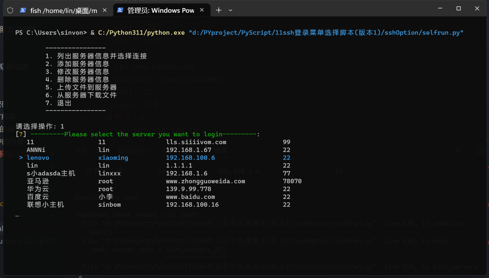
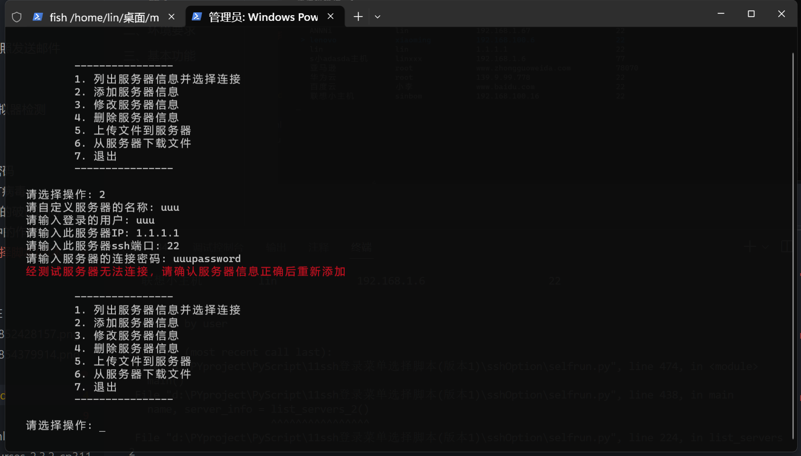
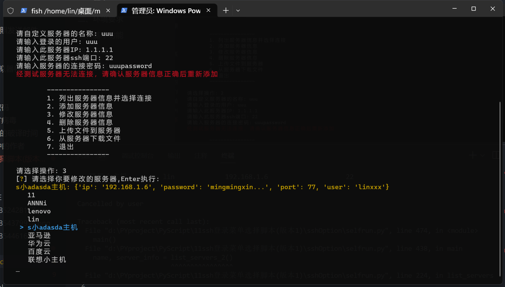
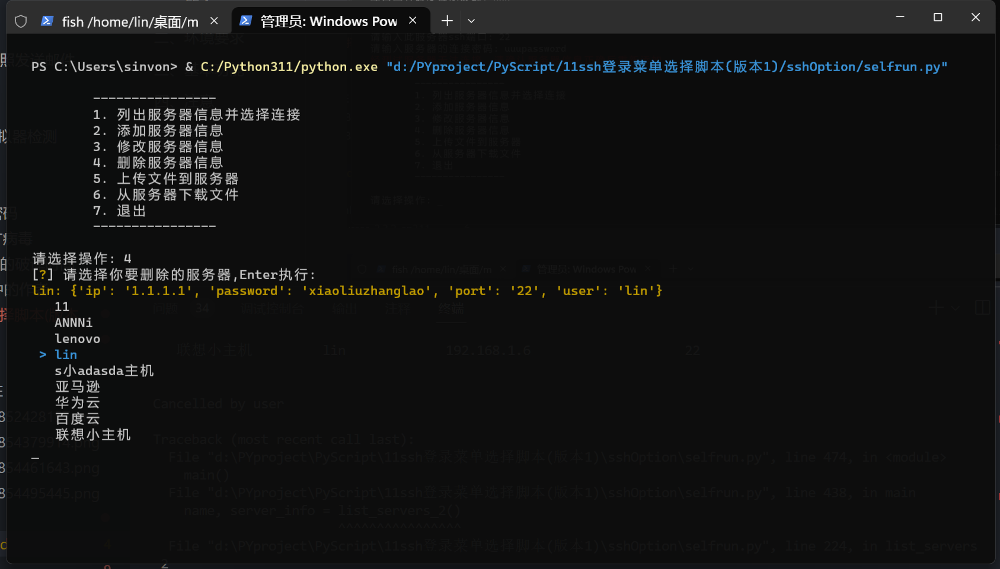

# 一、简介

**sshOption**是我在闲暇之余开发的一款工具, 能可视化地在终端实现客户端和服务端一些基本功能. 该脚本支持linux,macos,window终端上使用.

# 二、环境要求

1. 需要安装python环境, 安装依赖包:在requirements所在的根目录打开终端执行**pip install -r requirements.txt**
2. 需要对工具配置环境变量, 以实现任何地方都能在终端启动此脚本

# 三、基本功能

1. 可以添加服务器信息, 程序会将服务器存储到yaml中, 因为考虑到迁移的需求, 所以数据数据使用yaml来存储,   yaml文件会存储服务器名称(可以自定义), 服务器IP地址, ssh端口号, ssh登录密码. 如果使用脚本功能中的'添加服务器' 进行添加服务器信息, 脚本会自动向服务器添加本机公钥,此后实现无密码登录
2. 如果服务器上已经存在本机公钥, 那么脚本不会重复添加, 你在添加服务器信息时可以将密码设置为空字符或者任意字符
3. 可以列出已经存储的服务器
4. 可以删除已存在的服务器信息
5. 可以任意修改服务器信息,或者直接在yaml文件中修改(不建议)
6. 可以实现客户端和服务端文件的上传和下载. 基于SCP

# 四、注意

第一次添加服务器前需要输入密码, 脚本自动测试连接性,连接成功后会将本机公钥添加至服务器, 然后即可实现无密码登录,如果服务器上已经存在本机公钥, 就不会不会重复添加。

# 五、展示

